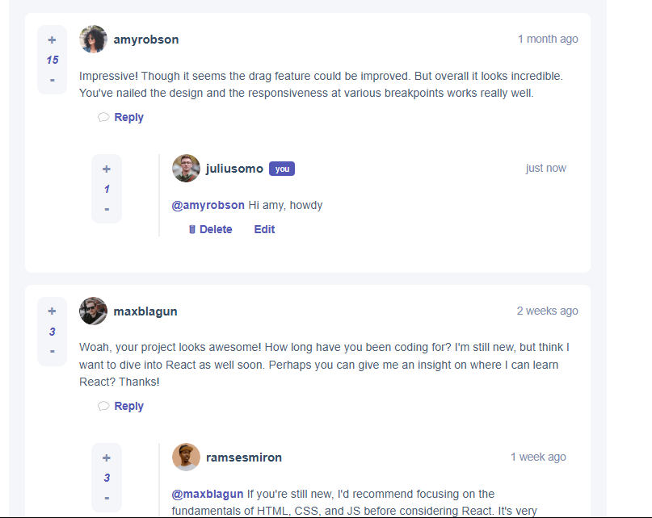
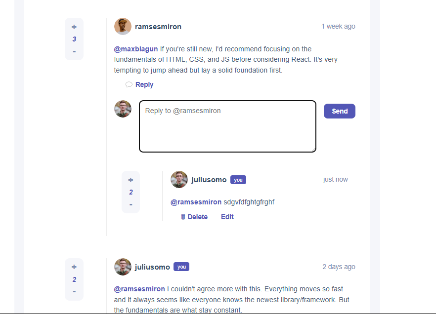

# 💬 Interactive Comments App (Frontend Only)

This is a React-based comment thread UI that allows users to post, reply, edit, delete, and vote on comments. Inspired by typical social/comment systems, this project is designed to showcase state management, component architecture, and React hooks — all without a backend.

## 🧠 Features

- ➕ Add replies to comments
- 🧾 Edit and delete your own comments
- 👍 Upvote and 👎 downvote comments (per user session)
- 🧵 Nested replies with clean thread visuals
- 🧍 Distinction between current user and others
- 🔥 Smooth UI with modal confirmations and inline editing

## 🛠 Tech Stack

- **React** (useState, props drilling, basic context)
- **CSS** for styling (no frameworks)
- Local mock data (`data.json`) to simulate users and comments

## 📁 File Structure

/src /components CommentCard.js 
Reusable component for both comments and replies 
/context CommentsContext.js 
Context API to manage global comment state - /data data.json 
Contains initial comment thread and user data - CommentCard.css 
Styling for comment UI - App.js
Main component rendering the comment thread

## ⚙️ Setup & Run
git clone https://github.com/your-username/interactive-comments-app.git
cd interactive-comments-app
npm install
npm start

## 🌍 Frontend Mentor
This project is based on a challenge from Frontend Mentor.
Frontend Mentor is a platform that provides real-world frontend challenges to help you level up your coding skills.

You can view the original challenge here:
🔗 Interactive Comments Section Challenge - https://www.frontendmentor.io/challenges/interactive-comments-section-iG1RugEG9

# 📚 What I Learnt
State lifting and sharing using context

Recursive rendering of nested components

Managing modal logic and confirmation flows

React component architecture + clean CSS design

# 🚀 Future Improvements (Optional)
Persist comments with localStorage or backend (e.g., Firebase, Node)

User authentication

Better UX for long threads (collapsing, pagination, etc.)

Markdown support for rich text comments
